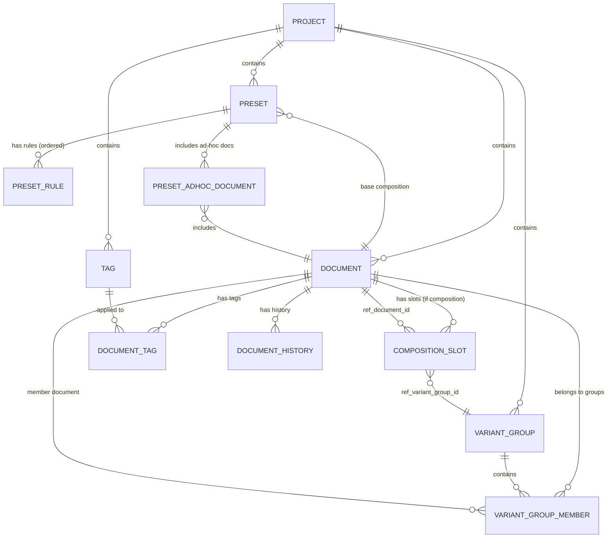

# Entity Relationship Diagram (ERD)

## Extendable Markdown Editor — Data Model

---

## 1. Architecture Context

The data model is divided between the **logic layer** (engine) and the **presentation layer** (UI). This ERD covers the logic layer — the entities the engine owns, persists, and operates on. Presentation-layer state (variables, manual overrides, UI preferences) is not part of this schema.

The same data model is shared by both products (Power App and Reader App). The difference between products is in the **data provider** implementation: the Power App's data provider returns all documents; the Reader App's data provider filters by the reader's access level.

---

## 2. Entity Overview

```
┌─────────────┐      ┌─────────────────┐      ┌───────────────┐
│   Project    │──1:N─│    Document      │──N:M─│     Tag       │
└─────────────┘      │  (leaf | comp)   │      │  (key:value)  │
                     └────────┬────────┘      └───────────────┘
                              │
              ┌───────────────┼───────────────┐
              │               │               │
              ▼               ▼               ▼
   ┌──────────────┐  ┌───────────────┐  ┌──────────────────┐
   │ Composition  │  │ Variant Group │  │ Document History  │
   │    Slot      │  │               │  │                   │
   └──────┬───────┘  └───────┬───────┘  └──────────────────┘
          │                  │
          │    references     │
          ├──────────────────┤
          │                  │
          ▼                  ▼
   ┌─────────────────────────────────┐
   │  Variant Group Member           │
   │  (document_id + variant_group_id)│
   └─────────────────────────────────┘

   ┌──────────────┐      ┌───────────────────┐
   │    Preset     │──1:N─│   Preset Rule      │
   │              │      │ (where/do ordered)  │
   │              │──1:N─│   Preset Ad-Hoc Doc │
   └──────────────┘      └───────────────────┘
```

---

## 3. Entities

### 3.1 Project

Top-level container. All entities are project-scoped.

| Column | Type | Constraints | Description |
|---|---|---|---|
| `id` | UUID | PK, default `gen_random_uuid()` | Unique project identifier |
| `name` | TEXT | NOT NULL | Project name |
| `created_at` | TIMESTAMPTZ | NOT NULL, default `now()` | Creation timestamp |
| `updated_at` | TIMESTAMPTZ | NOT NULL, default `now()` | Last modification timestamp |

---

### 3.2 Document

The core entity. Either a **leaf** (has content, no slots) or a **composition** (has slots, no content). Enforced at the database level.

| Column | Type | Constraints | Description |
|---|---|---|---|
| `id` | UUID | PK, default `gen_random_uuid()` | Unique document identifier |
| `project_id` | UUID | NOT NULL, FK → `projects.id` ON DELETE CASCADE | Owning project |
| `title` | TEXT | NOT NULL | Document title |
| `alias` | TEXT | NULL | Comma-separated aliases for search/autocomplete |
| `is_composition` | BOOLEAN | NOT NULL, default `FALSE` | `TRUE` = composition (slots, no content). `FALSE` = leaf (content, no slots). |
| `content` | TEXT | NULL | Markdown content. Must be NULL if `is_composition = TRUE`. |
| `created_at` | TIMESTAMPTZ | NOT NULL, default `now()` | Creation timestamp |
| `updated_at` | TIMESTAMPTZ | NOT NULL, default `now()` | Last modification timestamp |

**Constraints:**

```sql
-- Leaf documents must have content (or empty string), compositions must not
CONSTRAINT check_document_kind CHECK (
    (is_composition = FALSE) OR
    (is_composition = TRUE AND content IS NULL)
)
```

**Indexes:**

```sql
CREATE INDEX idx_documents_project_id ON documents(project_id);
CREATE INDEX idx_documents_title ON documents(project_id, title);
CREATE INDEX idx_documents_alias ON documents USING gin(to_tsvector('english', coalesce(alias, '')));
```

---

### 3.3 Composition Slot

An ordered entry within a composition document. Each slot references either a document directly or a variant group.

| Column | Type | Constraints | Description |
|---|---|---|---|
| `id` | UUID | PK, default `gen_random_uuid()` | Unique slot identifier |
| `composition_id` | UUID | NOT NULL, FK → `documents.id` ON DELETE CASCADE | The composition this slot belongs to. Must reference a document where `is_composition = TRUE`. |
| `slot_order` | INTEGER | NOT NULL | Position within the composition (0-indexed). |
| `ref_type` | TEXT | NOT NULL, CHECK IN (`'document'`, `'variant_group'`) | What this slot points to. |
| `ref_document_id` | UUID | NULL, FK → `documents.id` ON DELETE SET NULL | Direct document reference. Required if `ref_type = 'document'`. |
| `ref_variant_group_id` | UUID | NULL, FK → `variant_groups.id` ON DELETE SET NULL | Variant group reference. Required if `ref_type = 'variant_group'`. |

**Note:** The `selected_document_id` column from the original design has been removed. Variant selection is now determined entirely by preset rules, variables, and presentation-layer manual overrides — not stored on the slot itself.

**Constraints:**

```sql
-- Exactly one reference must be set based on ref_type
CONSTRAINT check_slot_reference CHECK (
    (ref_type = 'document' AND ref_document_id IS NOT NULL AND ref_variant_group_id IS NULL) OR
    (ref_type = 'variant_group' AND ref_variant_group_id IS NOT NULL AND ref_document_id IS NULL)
)

-- Unique order per composition
CONSTRAINT unique_slot_order UNIQUE (composition_id, slot_order)
```

**Indexes:**

```sql
CREATE INDEX idx_composition_slots_composition ON composition_slots(composition_id, slot_order);
CREATE INDEX idx_composition_slots_ref_document ON composition_slots(ref_document_id);
CREATE INDEX idx_composition_slots_ref_variant ON composition_slots(ref_variant_group_id);
```

---

### 3.4 Variant Group

A named set of interchangeable documents. Not a document. Cannot nest.

| Column | Type | Constraints | Description |
|---|---|---|---|
| `id` | UUID | PK, default `gen_random_uuid()` | Unique variant group identifier |
| `project_id` | UUID | NOT NULL, FK → `projects.id` ON DELETE CASCADE | Owning project |
| `name` | TEXT | NOT NULL | Display name (e.g., "Chapter 3 Variants", "Elara Profiles") |
| `created_at` | TIMESTAMPTZ | NOT NULL, default `now()` | Creation timestamp |

**Indexes:**

```sql
CREATE INDEX idx_variant_groups_project ON variant_groups(project_id);
```

---

### 3.5 Variant Group Member

Join table linking documents to variant groups. Ordered — first member is the default.

**Constraint: the document at `member_order = 0` must be universally accessible (all-access).** This is the fallback for readers who cannot access any other member. For paid content, this default can be a paywall placeholder document.

| Column | Type | Constraints | Description |
|---|---|---|---|
| `variant_group_id` | UUID | NOT NULL, FK → `variant_groups.id` ON DELETE CASCADE | The variant group |
| `document_id` | UUID | NOT NULL, FK → `documents.id` ON DELETE CASCADE | The document in the group |
| `member_order` | INTEGER | NOT NULL | Order within the group (0 = universal default) |
| `created_at` | TIMESTAMPTZ | NOT NULL, default `now()` | When added |

**Constraints:**

```sql
PRIMARY KEY (variant_group_id, document_id)

-- No duplicate ordering within a group
CONSTRAINT unique_member_order UNIQUE (variant_group_id, member_order)
```

**Indexes:**

```sql
CREATE INDEX idx_variant_group_members_group ON variant_group_members(variant_group_id, member_order);
CREATE INDEX idx_variant_group_members_document ON variant_group_members(document_id);
```

---

### 3.6 Tag

Project-scoped tag definitions. Tags are **key-value pairs** used for document organization and as the primary matching mechanism for preset rules.

| Column | Type | Constraints | Description |
|---|---|---|---|
| `id` | UUID | PK, default `gen_random_uuid()` | Unique tag identifier |
| `project_id` | UUID | NOT NULL, FK → `projects.id` ON DELETE CASCADE | Owning project |
| `key` | TEXT | NOT NULL | Tag key (e.g., `lang`, `chapter`, `char`, `fanfic`, `summary`, `tier`) |
| `value` | TEXT | NOT NULL | Tag value (e.g., `ja`, `103`, `elara`, `A`, `chapter`, `premium`) |
| `color` | TEXT | default `'#6366f1'` | Hex color for UI display |
| `created_at` | TIMESTAMPTZ | NOT NULL, default `now()` | Creation timestamp |

**Constraints:**

```sql
-- Each key:value pair is unique per project
CONSTRAINT unique_tag_per_project UNIQUE (project_id, key, value)
```

**Indexes:**

```sql
CREATE INDEX idx_tags_project ON tags(project_id);
CREATE INDEX idx_tags_key ON tags(project_id, key);
CREATE INDEX idx_tags_key_value ON tags(project_id, key, value);
```

---

### 3.7 Document Tag

Many-to-many join between documents and tags.

| Column | Type | Constraints | Description |
|---|---|---|---|
| `document_id` | UUID | NOT NULL, FK → `documents.id` ON DELETE CASCADE | |
| `tag_id` | UUID | NOT NULL, FK → `tags.id` ON DELETE CASCADE | |

```sql
PRIMARY KEY (document_id, tag_id)
```

**Indexes:**

```sql
CREATE INDEX idx_document_tags_document ON document_tags(document_id);
CREATE INDEX idx_document_tags_tag ON document_tags(tag_id);
```

---

### 3.8 Preset

A named configuration for resolving a composition. Contains an ordered list of rules and optional ad-hoc document references.

**Note:** Presets no longer contain per-slot entries (`is_enabled`, `override_variant_document_id`). That static override model is replaced by the rule engine. Manual overrides are presentation-layer state, not persisted in the engine.

| Column | Type | Constraints | Description |
|---|---|---|---|
| `id` | UUID | PK, default `gen_random_uuid()` | Unique preset identifier |
| `project_id` | UUID | NOT NULL, FK → `projects.id` ON DELETE CASCADE | Owning project |
| `name` | TEXT | NOT NULL | Preset name (e.g., "Active Context", "Reader Default", "Fanfic B Branch") |
| `composition_id` | UUID | NOT NULL, FK → `documents.id` ON DELETE CASCADE | The base composition this preset configures. Must reference a composition document. |
| `created_at` | TIMESTAMPTZ | NOT NULL, default `now()` | Creation timestamp |
| `updated_at` | TIMESTAMPTZ | NOT NULL, default `now()` | Last modification timestamp |

**Indexes:**

```sql
CREATE INDEX idx_presets_project ON presets(project_id);
CREATE INDEX idx_presets_composition ON presets(composition_id);
```

---

### 3.9 Preset Rule

An ordered rule within a preset. Follows the `where <premise> do <action>` pattern. Rules are evaluated in sequence; later rules override earlier ones on the same slot/member.

| Column | Type | Constraints | Description |
|---|---|---|---|
| `id` | UUID | PK, default `gen_random_uuid()` | Unique rule identifier |
| `preset_id` | UUID | NOT NULL, FK → `presets.id` ON DELETE CASCADE | Owning preset |
| `rule_order` | INTEGER | NOT NULL | Evaluation order (0-indexed). Later rules override earlier ones. |
| `premise` | JSONB | NOT NULL | Condition expression. See Premise Schema below. |
| `action_type` | TEXT | NOT NULL, CHECK IN (`'sort_by'`, `'toggle_on'`, `'toggle_off'`, `'select'`) | What the rule does. |
| `action_params` | JSONB | NOT NULL | Action parameters. See Action Schema below. |
| `description` | TEXT | NULL | Human-readable description of this rule's purpose |

**Constraints:**

```sql
CONSTRAINT unique_rule_order UNIQUE (preset_id, rule_order)
```

**Indexes:**

```sql
CREATE INDEX idx_preset_rules_preset ON preset_rules(preset_id, rule_order);
```

**Premise Schema (JSONB):**

Premises are recursive condition trees supporting AND, OR, NOT, and leaf conditions.

```json
// Variable comparison (evaluates globally, no document context)
{ "type": "var", "name": "lang", "op": "=", "value": "ja" }
{ "type": "var", "name": "mode", "op": "!=", "value": "reader" }
{ "type": "var", "name": "lang", "op": "not_null" }
{ "type": "var", "name": "activechars", "op": "contains", "value": "elara" }

// Tag comparison (evaluates per document/member)
{ "type": "tag", "key": "chapter", "op": "<", "value": 103 }
{ "type": "tag", "key": "char", "op": "not_in", "var_ref": "activechars" }
{ "type": "tag", "key": "fanfic", "op": "=", "value": "B" }

// Always true (used with sort rules that apply universally)
{ "type": "always" }

// Compound
{ "type": "and", "conditions": [ ... ] }
{ "type": "or", "conditions": [ ... ] }
{ "type": "not", "condition": { ... } }
```

**Action Schema (JSONB):**

```json
// sort_by: preference-ordered list of tag key:value pairs
// Resolution picks the first accessible member matching the highest-priority sort key
// Supports literal values and variable references
{ "preferences": [
    { "tag_key": "fanfic", "value": "B" },
    { "tag_key": "fanfic", "value": "A" }
  ],
  "secondary_sort": { "tag_key": "lang", "var_ref": "lang" }
}

// toggle_on / toggle_off: no additional params needed (the premise determines which slots)
{}

// select: hard-select a variant by tag match
{ "tag_key": "summary", "value": "chapter" }
```

---

### 3.10 Preset Ad-Hoc Document

Allows a preset to include individual documents outside the composition tree. For ad-hoc context inclusion.

| Column | Type | Constraints | Description |
|---|---|---|---|
| `id` | UUID | PK, default `gen_random_uuid()` | Unique identifier |
| `preset_id` | UUID | NOT NULL, FK → `presets.id` ON DELETE CASCADE | Owning preset |
| `document_id` | UUID | NOT NULL, FK → `documents.id` ON DELETE CASCADE | The document to include |
| `inclusion_order` | INTEGER | NOT NULL | Order relative to other ad-hoc documents (appended after composition slots) |

**Note:** The `is_enabled` field has been removed. Ad-hoc document toggling is a presentation-layer concern (manual override).

**Constraints:**

```sql
CONSTRAINT unique_preset_adhoc_document UNIQUE (preset_id, document_id)
CONSTRAINT unique_preset_adhoc_order UNIQUE (preset_id, inclusion_order)
```

---

### 3.11 Document History

Immutable snapshots of document state for versioning and rollback.

| Column | Type | Constraints | Description |
|---|---|---|---|
| `id` | UUID | PK, default `gen_random_uuid()` | Unique history entry identifier |
| `document_id` | UUID | NOT NULL, FK → `documents.id` ON DELETE CASCADE | The document this snapshot is for |
| `project_id` | UUID | NOT NULL, FK → `projects.id` ON DELETE CASCADE | Owning project |
| `title` | TEXT | NOT NULL | Document title at time of snapshot |
| `content` | TEXT | NULL | Document content at time of snapshot |
| `is_composition` | BOOLEAN | NOT NULL | Whether it was a composition at snapshot time |
| `change_type` | TEXT | NOT NULL | One of: `create`, `update_content`, `update_title`, `delete` |
| `change_description` | TEXT | NULL | Human-readable description |
| `created_at` | TIMESTAMPTZ | NOT NULL, default `now()` | Snapshot timestamp |

**Indexes:**

```sql
CREATE INDEX idx_document_history_document ON document_history(document_id, created_at DESC);
CREATE INDEX idx_document_history_project ON document_history(project_id);
```

---

## 4. Relationship Diagram (Mermaid)



---

## 5. Circular Reference Prevention

Compositions can reference other compositions, creating the potential for cycles. This must be prevented at write time.

### 5.1 Detection Algorithm

When adding or updating a composition slot to reference document D:

```
function would_create_cycle(composition_id, target_document_id):
    if target_document_id == composition_id:
        return TRUE  // self-reference

    if target_document is not a composition:
        return FALSE  // leaf can't create a cycle

    // Walk the target's slot tree looking for composition_id
    visited = {composition_id}
    queue = [target_document_id]

    while queue is not empty:
        current = queue.pop()
        if current in visited:
            return TRUE
        visited.add(current)

        for slot in composition_slots where composition_id = current:
            if slot.ref_type == 'document' and slot.ref_document_id is a composition:
                queue.add(slot.ref_document_id)
            if slot.ref_type == 'variant_group':
                for member in variant_group_members where variant_group_id = slot.ref_variant_group_id:
                    if member.document is a composition:
                        queue.add(member.document_id)

    return FALSE
```

### 5.2 Variant Group Complication

Cycles can also occur through variant groups. If composition A has a slot pointing to variant group V, and V contains composition B, and B has a slot pointing to A — that's a cycle. The detection algorithm must follow variant group memberships, not just direct document references.

---

## 6. Resolution Algorithm

### 6.1 Engine Signature

The resolution engine is a pure function:

```
function resolve(preset_id, variables, access_filter) → string
```

Where:
- `preset_id` — identifies the preset (rules + composition reference)
- `variables` — `Map<string, any>` — runtime name-value pairs from the presentation layer
- `access_filter` — `function(document_id) → boolean` — injected dependency from the product layer

### 6.2 Rule Evaluation Phase

Before tree walking, rules produce a **selection map**:

```
function evaluate_rules(preset, variables, access_filter):
    rules = get_preset_rules(preset.id) ordered by rule_order
    slots = get_all_slots_recursive(preset.composition_id)
    
    // Initialize selection map with defaults
    selection_map = {
        toggle_states: Map<slot_id, boolean>  // all default to ON
        sort_orders: Map<slot_id, List<document_id>>  // all default to member_order
    }
    
    for rule in rules:
        premise_result = evaluate_premise(rule.premise, variables)
        
        if rule.premise references only variables:
            // Global evaluation — premise is true/false once
            if premise_result:
                apply_action_to_all_matching_slots(rule, selection_map, slots)
        else:
            // Per-slot/per-member evaluation
            for slot in slots:
                if rule.action_type in ['toggle_on', 'toggle_off']:
                    // Evaluate premise against the slot's target document's tags
                    target_doc = resolve_slot_to_document(slot)
                    if evaluate_premise_with_tags(rule.premise, variables, target_doc.tags):
                        apply_toggle(rule.action_type, slot.id, selection_map)
                        
                if rule.action_type in ['sort_by', 'select']:
                    // Evaluate premise against each variant group member
                    if slot.ref_type == 'variant_group':
                        members = get_members(slot.ref_variant_group_id)
                        accessible_members = filter(members, access_filter)
                        sorted_members = apply_sort(rule.action_params, accessible_members, variables)
                        selection_map.sort_orders[slot.id] = sorted_members
    
    return selection_map
```

### 6.3 Tree Walking Phase

```
function resolve_tree(node_id, selection_map, access_filter, depth=0, max_depth=20):
    if depth >= max_depth:
        return "[ERROR: Maximum recursion depth exceeded]"

    document = fetch_document(node_id)
    if document is NULL:
        return "[ERROR: Document not found]"

    // LEAF — return content
    if not document.is_composition:
        return document.content ?? ""

    // COMPOSITION — walk slots
    parts = []
    slots = fetch_slots(document.id) ordered by slot_order

    for slot in slots:
        // Check toggle state
        if selection_map.toggle_states[slot.id] == OFF:
            continue

        // Resolve slot to a document ID
        target_id = NULL
        
        if slot.ref_type == 'document':
            target_id = slot.ref_document_id
            
        else if slot.ref_type == 'variant_group':
            sorted_members = selection_map.sort_orders.get(slot.id)
            if sorted_members is not NULL and len(sorted_members) > 0:
                target_id = sorted_members[0]  // first accessible member per sort order
            else:
                // Fallback to group default (position 0, guaranteed accessible)
                target_id = get_first_member(slot.ref_variant_group_id)

        if target_id is NULL:
            continue  // broken reference

        parts.append(resolve_tree(target_id, selection_map, access_filter, depth + 1, max_depth))

    return join(parts, "\n\n")
```

### 6.4 Preset Resolution (Full)

```
function resolve_preset(preset_id, variables, access_filter):
    preset = get_preset(preset_id)
    
    // Phase 1: Evaluate rules → selection map
    selection_map = evaluate_rules(preset, variables, access_filter)
    
    // Phase 1.5: Presentation layer may mutate selection_map with manual overrides
    // (This happens outside the engine — the engine receives the final selection_map)
    
    // Phase 2: Walk the tree
    output = resolve_tree(preset.composition_id, selection_map, access_filter)
    
    // Phase 3: Append ad-hoc documents
    adhoc_docs = get_preset_adhoc_documents(preset_id) ordered by inclusion_order
    for adhoc in adhoc_docs:
        // Ad-hoc toggle is a presentation-layer concern; if it reaches the engine, it's included
        adhoc_content = resolve_tree(adhoc.document_id, selection_map, access_filter)
        output = output + "\n\n" + adhoc_content
    
    return output
```

---

## 7. Token Estimation

Token estimation is performed on the resolved markdown output *before* writing the `.md` file. The estimate uses a simple heuristic:

```
estimated_tokens = character_count / 4
```

This is a conservative approximation. The UI displays:
- Estimated token count
- A configurable "budget" field (e.g., 15,000 tokens)
- Visual indicator (green/yellow/red) based on percentage of budget consumed

Token estimation is **informational only** — it does not prevent resolution or export.

---

## 8. Migration Notes (from Continuum)

This is a **new project** — no migration from Continuum's schema is required. However, the design deliberately addresses Continuum's known issues:

| Continuum Issue | New Design Solution |
|---|---|
| `group_id` on documents served as both folder and variant container | Variant groups are a separate entity with no content or dual identity |
| `{{handlebar}}` syntax in document body for composition | Composition is a structural property (slots), not embedded in content |
| `is_composite` and `is_prompt` boolean flags created ambiguous document types | Single `is_composition` boolean with strict mutual exclusion enforced by constraints |
| Preset/composition conflated context assembly with variant selection | Composition handles structure. Presets handle rules + resolution configuration. Manual overrides live in the presentation layer. |
| Deletion of group head broke all children | Variant group deletion produces explicit broken references in compositions |
| Static per-slot preset entries required manual updates for every chapter transition | Dynamic rule engine with variables enables automatic context sliding |
| Flat tags lacked semantic structure for rule matching | Key-value tags enable structured matching (e.g., `tag(chapter) < 103`) |
